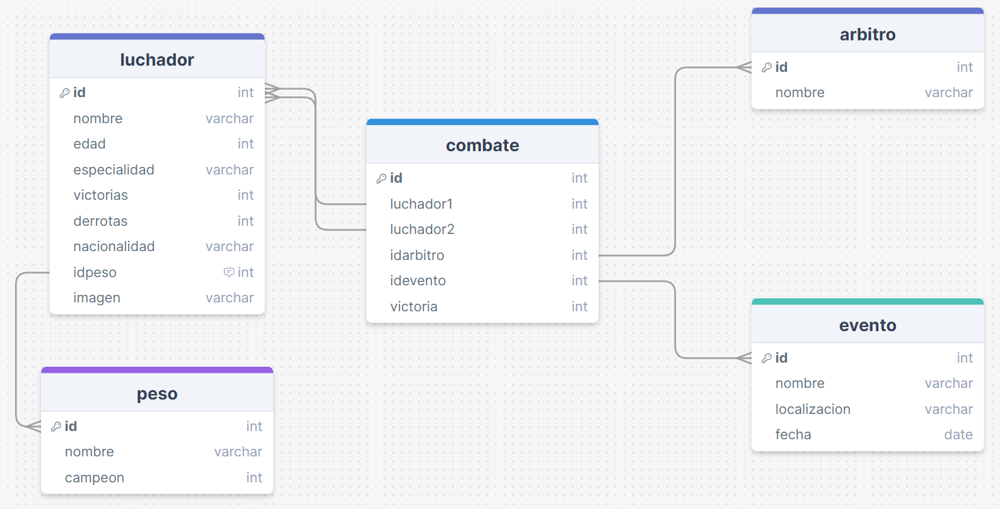

# CORRER PROYECTO

## **Opcion 1** 
## Con back-end en Docker
### Clonar Repositorio , acceder desde terminal a carpeta **backDocker** 
```
cd ./backDocker/
```
### Construir compose
```
docker-compose up -d
```
**Asegurar que los dos contenedores creados esten corriendo**
### Acceder al enlace del front desplegado :
https://front-angular-ufc.vercel.app/home
## Guia para Dockerizar backend
[Dockerizar API Nodejs y Datos Postgress](docker.md)
  
  Login - Usuario: manolo8 - contraseña : onmula
**-----------------------------------------------------**  
  
    
## **Opcion 2**
## Con Maquina local
### Clonamos el Repositorio localmente 
```
git clone https://github.com/alexgeviden/ufc-practica
```
### Crear docker postgress con la base de datos
#### Usaremos el Dockerfile en la carpeta **basedatos** para importar los datos y crear el contenedor automaticamente
```
cd ./basedatos/
docker build -t ufcdatos .
docker run -d --name postgresufc-datos -p 5432:5432  ufcdatos
```
**Mantener Docker activo**
### Acceder al repositorio local por terminal y ejecutar lo siguiente:
```
cd ./frontufc/

npm install

cd ../backend/

npm install
npm run dev

cd ../frontufc
ng serve -o
```
# Datos de comprension


### Relaciones
#### Peso
```javaScript
// One to many : peso -> luchador
Peso.hasMany(luchador , {
    foreingKey: 'idpeso',
    sourceKey: 'id'
})
luchador.belongsTo(Peso,{
    foreingKey: 'idpeso',
    targetId: 'id'
})
```
#### Evento
```javaScript
//One to many evento -> combate
Evento.hasMany(combate, {
    foreignKey: 'idevento',
    sourceKey: 'id'
})

combate.belongsTo(Evento, {
    foreignKey: 'idevento',
    targetId: 'id'
})
```
#### Arbitro
```javaScript
// One to many arbitro -> combate
Arbitro.hasMany(combate, {
    foreignKey: 'idarbitro',
    sourceKey: 'id'
})

combate.belongsTo(Arbitro, {
    foreignKey: 'idarbitro',
    targetId: 'id'
})
```
#### Luchadores - Combates 
Se genera una tabla intermedia automaticamente con el nombre de la relación.
- En luchador
```javaScript
Luchador.belongsToMany(combate, {
    through: 'ParticipacionEnCombate',
    foreignKey: 'idLuchador'
  });
```
- En combate 
```javaScript

Combate.belongsToMany(luchador, {
    through: 'ParticipacionEnCombate',
    foreignKey: 'idCombate'
  });
  
```
- Victorias de los combates 
```javaScript
Combate.belongsTo(Luchador, {
   foreignKey: 'victoria',
   targetKey: 'id'
});

Luchador.hasMany(Combate, {
   foreignKey: 'victoria',
   sourceKey: 'id'
});
```
#### Luchadores - Peso - Campeones
Se genera una tabla intermedia automaticamente con el nombre de la relación.
- En Peso
```javaScript
Peso.belongsToMany(Luchador, {
   through: 'campeones',
   foreignKey: 'idPeso'
} );


```
- En Luchador 
```javaScript

Luchador.belongsToMany(Peso, {
   through: 'campeones',
   foreignKey: 'idLuchador'
} );

```
## Proceso de Migración en Sequelize para añadir una columna a tabla ManytoMany

1. **Crear una Migración:**
   Para agregar una columna a una tabla existente en Sequelize, primero creamos una migración utilizando el comando   

   `npx sequelize-cli migration:generate --name nombre_de_la_migracion`.

   **Si no funciona el comando hemos de instalar la CLI de sequelize**  
   ``npm install -g sequelize-cli``

2. **Editar la Migración:**
   Abrimos el archivo de migración generado en la carpeta `migrations` y escribimos los comandos necesarios para agregar la columna deseada a la tabla existente. 
 ```javaScript

'use strict';

module.exports = {
  async up(queryInterface, Sequelize) {
    await queryInterface.addColumn('campeones', 'defensas', {
      type: Sequelize.INTEGER,
      defaultValue: 0 
    });
  },

  async down(queryInterface, Sequelize) {
    await queryInterface.removeColumn('campeones', 'defensas');
  }
};

  
```
   
   Esto se hace en las funciones `up` y `down` del archivo de migración.

3. **Aplicar la Migración:**
   Utilizamos el comando `npx sequelize-cli db:migrate` para aplicar la migración y realizar los cambios en la base de datos.

4. **Revertir la Migración (Opcional):**
   Si es necesario revertir la migración, podemos utilizar el comando  
    `npx sequelize-cli db:migrate:undo`   
    para deshacer los cambios realizados por la última migración aplicada.


## Consultas a realizar por modelo
Se dan por echo las siquientes consultas 
- Insertar 
- Actualizar
- Eliminar
- Listar
 
### Luchador

- Luchadores por peso

### Eventos
- Combates por evento

### Combate

- Combates asignados y arbitros

- Introducir participacion en una pelea , solo 2 por idCombate y tienen que ser del mismo peso  
Ejemplo de insersion json :
```json
{
    "luchador1": 4,
    "luchador2": 5
}
```

